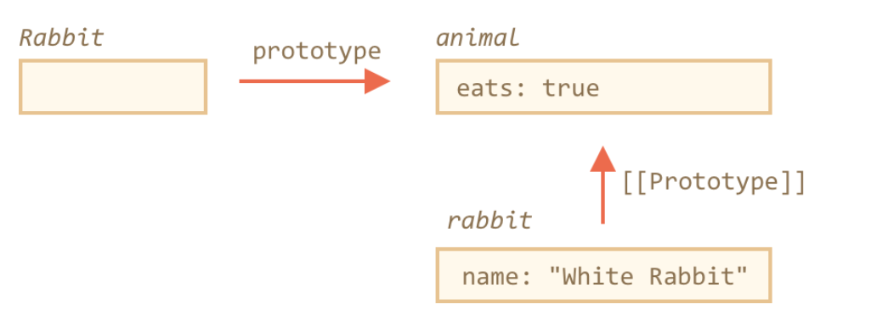
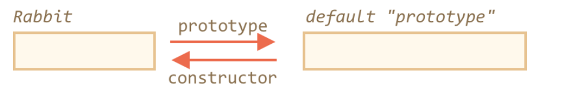
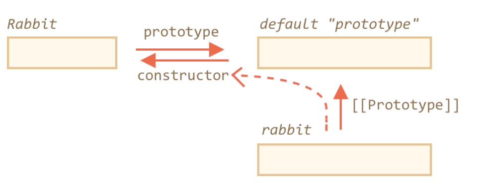

# F.prototype
* each function has such property (prototype)
* it has a default value which is an object
  * `{ constructor }`
  * the constructor property references back to the function


## Overview
* new F() -> return an object
* F.prototype references the A prototype-object
  * const theObj = new F()
  * theObj[[Prototype]] references the A prototype-object
    * `theObj.__proto__ === F.prototype`
* "prototype" property
  * the special property for **constructor**

## example

```js

let animal = {
  eats: true,
}


function Rabbit(name) {
  this.name = name
}

Rabbit.prototype = animal;
let rabbit = new Rabbit('Bunny');
rabbit.eats // true

```

<br />



### how prototype works

* F.prototype property is only used when new F is called, it assigns [[Prototype]] of the new object. After that, there’s no connection between F.prototype and the new object. Think of it as a “one-time gift”.

* If, after the creation, F.prototype property changes (F.prototype = <another object>), then new objects created by new F will have another object as [[Prototype]], but already existing objects keep the old one.


## Default value for prototype

### Overview

* an object
 * with single property - constructor - which references back to the function


```js

function Rabbit() {

}

```




### Access constructor through instance

* Naturally, if we do nothing, the constructor property is available to all rabbits through [[Prototype]]:



* access constructor through instance
  * goal: we need to create another object from.


```js

function Rabbit(name) {
  this.name = name;
  alert(name);
}

let rabbit = new Rabbit("White Rabbit");

let rabbit2 = new rabbit.constructor("Black Rabbit");

```

## Caveat
* JavaScript itself does not ensure the right "constructor" value.

* wrong practice

```js

function Rabbit() {}
Rabbit.prototype = {
  jumps: true
};

let rabbit = new Rabbit();
alert(rabbit.constructor === Rabbit); // false

```

* good practice

```js

// 1
function Rabbit() {}

// Not overwrite Rabbit.prototype totally
// just add to it
Rabbit.prototype.jumps = true
// the default Rabbit.prototype.constructor is preserved


// 2
Rabbit.prototype = {
  jumps: true,
  constructor: Rabbit
};

// now constructor is also correct, because we added it

```


## Summary

* The F.prototype property is not the same as [[Prototype]]. The only thing F.prototype does: it sets [[Prototype]] of new objects when new F() is called.
* The value of F.prototype should be either an object or null: other values won’t work.
* The "prototype" property only has such a special effect when set on a constructor function, and invoked with new.

* On regular objects the prototype is nothing special:

```js

let user = {
  name: "John",
  prototype: "Bla-bla" // no magic at all
};

```


* By default all functions have F.prototype = { constructor: F }, so we can get the constructor of an object by accessing its "constructor" property.
