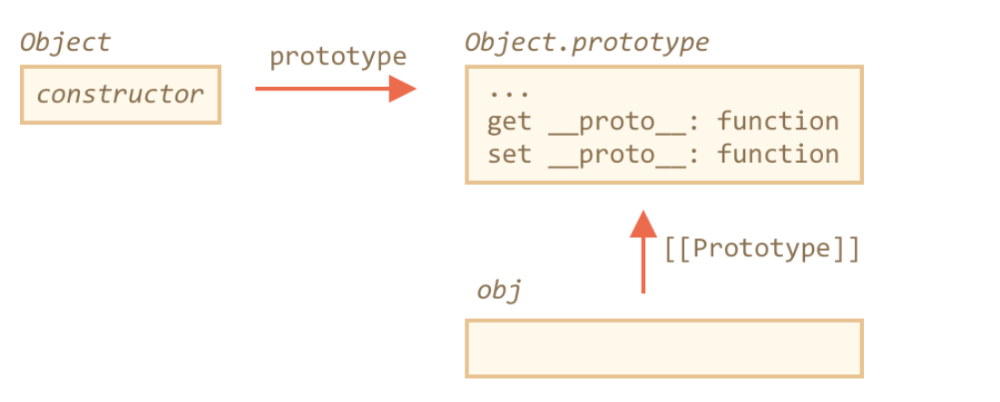
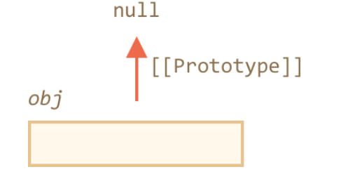

# [[Prototype]] related Methods

## How to set [[Prototype]]
1. __proto__
2. methods
  * Object.create(proto[, descriptors]) – creates an empty object with given proto as [[Prototype]] and optional property descriptors.
  * Object.getPrototypeOf(obj) – returns the [[Prototype]] of obj.
  * Object.setPrototypeOf(obj, proto) – sets the [[Prototype]] of obj to proto.


* example

```js

let animal = {
  eats: true
};

let rabbit = Object.create(animal, {
  jumps: {
    value: true
  }
});

alert(rabbit.jumps); // true

```

* Fully Clone an object
  * better than `for...in`
    * may loose some non-enumerable properties
  * make truly exact copy of object -> including all properties:
    * enumerable
    * non-enumerable
    * data properties
    * setters/getters
    * ...  
  * [shallow-copy] (https://flaviocopes.com/how-to-clone-javascript-object/)
    * [ref](https://we-are.bookmyshow.com/understanding-deep-and-shallow-copy-in-javascript-13438bad941c)
    * shallow copy: Shallow copy is a bit-wise copy of an object. A new object is created that has an exact copy of the values in the original object. If any of the fields of the object are references to other objects, just the reference addresses are copied i.e., only the memory address is copied.
    * deep copy: A deep copy copies all fields, and makes copies of dynamically allocated memory pointed to by the fields. A deep copy occurs when an object is copied along with the objects to which it refers.

```js

let clone = Object.create(Object.getPrototypeOf(obj),Object.getOwnPropertyDescriptors(obj));

```

## Don't reset [[Prototype]]
* Usually we only set it once at the object creation time. And JavaScript engines are highly optimized to that
* Changing a prototype “on-the-fly” with Object.setPrototypeOf or obj.__proto__= is a very slow operation
  * it breaks internal optimizations for object property access operations.

## History
1. __proto__
2. Object.create()
3. Object.setPrototypeOf(), Object.getPrototypeOf()

* 2. and 3. are created to replace __proto__
  * the reason is that __proto__ may cause glitch -> check plain objects


## Plain Objects
* Normal Object
  * goal:
    * use an object as an associative array
    * set a __proto__ key
  * store user-provided keys in it -> cause glitch


```js

let obj = {};

let key = prompt("What's the key?", "__proto__");
obj[key] = "some value";

alert(obj[key]); // [object Object], not "some value"!


```




* __prtoto__ only accept null || object
  * problem: the string will be ignored
  * solution:
    1. use Map
    2. Object.create(null)
      * __proto__ is **accessor property** from Object.prototype object


### Object.create(null)
* no setter/getter properties
* can set __proto__ as regular data property
* drawback: lose some useful build-in object methods, e.g., toString.

```js

let obj = Object.create(null);

let key = prompt("What's the key?", "__proto__");
obj[key] = "some value";

alert(obj[key]); // "some value"


```




## Note

All methods that return object properties (like Object.keys and others) – return “own” properties. If we want inherited ones, then we can use for..in.
