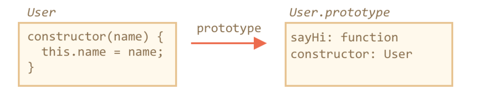

# Class
* overview: create objects of same kind
* class is a function
* instance has constructor property which points back to class/constructor function.

## Basic Syntax
* No comma between class methods
* The constructor() method is called automatically by new, so we can initialize the object there.

```js

class User {
  constructor(name) {
    this.name = name;
  }

  getName() {
    return this.name;
  }
}

const localUser = new User('Han');
console.log(localUser.getName());

```

## What is class
* a class is a kind of a function

```js

// class declaration
class User {
  constructor(name) { this.name = name; }
  sayHi() { alert(this.name); }
}

// proof: User is a function
alert(typeof User); // function


```

### How javascript work with class internally

* ex:
  ```js
    class User {
    constructor(name) { this.name = name; }
    sayHi() { alert(this.name); }
  }
  ```
* steps
  1. Creates a function named User, that becomes the result of the class declaration.
    * The function code is taken from the constructor method (assumed empty if we don’t write such method).
  2. Stores all methods, such as sayHi, in User.prototype.




```js

class User {
  constructor(name) { this.name = name; }
  sayHi() { alert(this.name); }
}

// class is a function
alert(typeof User); // function

// ...or, more precisely, the constructor method
alert(User === User.prototype.constructor); // true

// The methods are in User.prototype, e.g:
alert(User.prototype.sayHi); // alert(this.name);

// there are exactly two methods in the prototype
alert(Object.getOwnPropertyNames(User.prototype)); // constructor, sayHi


```

## Not just Syntax Sugar

* syntax sugar example

```js

function User(name) {
  this.name = name
}

User.prototype.sayHi = function() {
  console.log(this.name);
}

let user = new User('Han');
user.sayHi() // Han

```

* Not just syntax-sugar
  1. function created by class has special property
     * `[[FunctionKind]]:"classConstructor"`
    * class constructor can't be called without new operator
    * string representation: start with `class`
  2. Class methods are non-enumerable. A class definition sets enumerable flag to false for all methods in the "prototype".
  3. Classes always use strict. All code inside the class construct is automatically in strict mode.


```js

// example 1

class User {
  constructor() {}
}

alert(typeof User); // function
User(); // Error: Class constructor User cannot be invoked without 'new'

// example 2

class User {
  constructor() {}
}

alert(User); // class User { ... }


```

## Class Expression

* Class Expression


```js

let User = class {
  sayHi() {
    console.log('Hi')
  }
}


```

* Named Class Expression
  * If a class expression has a name, it’s visible inside the class only:

```js

let User = class MyClass {
  sayHi() {
    console.log(MyClass)
  }
}

User.sayHi()  // show MyClass
MyClass.sayHi() // error, MyClass not visible outside of the class

```

* make class dynamically on-demand

```js

function makeClass(phrase) {
  return class {
    sayHi() {
      console.log(phrase);
    }
  }
}

const User = makeClass('hello!!');
const user = new User();

user.sayHi() // hello!!

```

## Getters/setters, other shorthands

```js

class User {
  constructor(name) {
    this._name = null;
    this.name = name
  }

  set name(value) {
    if (value.length < 4) {
      console.log('the name is too short');
      return;
    }
    this._name = value;
  }

  get name() {
    return this._name;
  }
}

let user = new User('John');
user.name // John

let newUser = new User('Han'); // the name is too short

```
* the class declaration creates getters and setters in User.prototype, like this:


```js

Object.defineProperties(User.prototype, {
  name: {
    get() {
      return this._name
    },
    set(name) {
      // ...
    }
  }
});

```

## Public/Private Fields Declaration

* https://developer.mozilla.org/en-US/docs/Web/JavaScript/Reference/Classes

## Preview Conclusion
* class 'xyz' methods/properties are methods of xyz.prototype object
* static methods/properties are fields of xyz function.

## References
[class - MDN](https://developer.mozilla.org/en-US/docs/Web/JavaScript/Reference/Classes)
[class, private/public fields - tylermcginnis](https://tylermcginnis.com/javascript-private-and-public-class-fields/)
