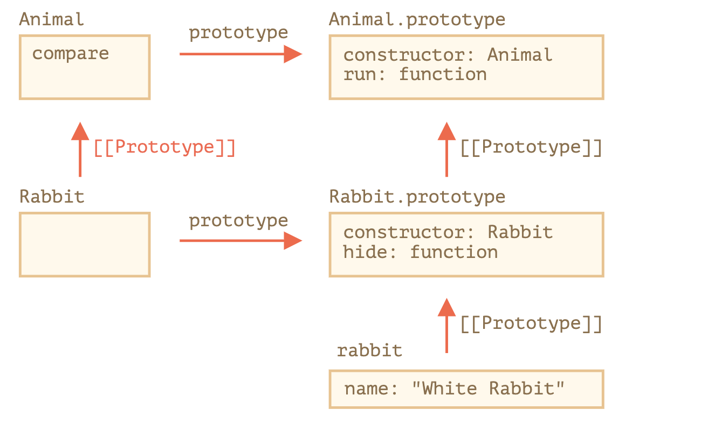

# Static Properties and Methods


## Prerequisite
* class xxx
  * xxx is constructor
  * constructor function is xxx
  * all rest methods are transferred to methods of xxx.prototype object.

```js
class Human {
  constructor(name) {
    this.name = name;
  }

  setWeight(value) {
    this.weight = value;
  }

  getWeight(value) {
    return this.weight;
  }
}


Human.prototype.setWeight // function
Human.prototype.getWeight // function
Human.constructor === Human // true
```

## Overview
* Static properties and methods are inherited.
* assign with static prefix or assign to the class itself directly.


## Static Methods
* assign method to class function itself rather than its prototype
* static method is the method of class  
* two types of assignment
  * static methodName
  * assign the method to class function directly

```js

//#1
class User {
  static staticMethod() {
    alert(this === User);
  }
}

User.staticMethod(); // true

//#2
class User() { }

User.staticMethod = function() {
  alert(this === User);
};

```

### Purpose
1. class method
2. factory method

```js

// example #1

class Article {
  constructor(title, date) {
    this.title = title;
    this.date = date;
  }

  static compare(articleA, articleB) {
    return articleA.date - articleB.date;
  }
}

// usage
let articles = [
  new Article("HTML", new Date(2019, 1, 1)),
  new Article("CSS", new Date(2019, 0, 1)),
  new Article("JavaScript", new Date(2019, 11, 1))
];

articles.sort(Article.compare);
alert( articles[0].title ); // CSS


// example #2

class Article {
  constructor(title, date) {
    this.title = title;
    this.date = date;
  }

  static createTodays() {
    // remember, this = Article
    return new this("Today's digest", new Date());
  }
}

let article = Article.createTodays();
alert( article.title ); // Todays digest

```


## Static Properties

```js

// #1
class Article {
  static publisher = "Ilya Kantor";
}

alert( Article.publisher ); // Ilya Kantor

// #2

Article.publisher = "Ilya Kantor";


```
## Inheritance of Static Methods

```js

class Animal {

  constructor(name, speed) {
    this.speed = speed;
    this.name = name;
  }

  run(speed = 0) {
    this.speed += speed;
    alert(`${this.name} runs with speed ${this.speed}.`);
  }

  static compare(animalA, animalB) {
    return animalA.speed - animalB.speed;
  }

}

// Inherit from Animal
class Rabbit extends Animal {
  hide() {
    alert(`${this.name} hides!`);
  }
}

let rabbits = [
  new Rabbit("White Rabbit", 10),
  new Rabbit("Black Rabbit", 5)
];

rabbits.sort(Rabbit.compare);


```


### How inheritance works

* `class Rabbit extneds Animal`
  * inheritance happen in two places
    1. Rabbit function prototypally inherits from Animal function. (class, constructor function)
    2. Rabbit.prototype prototypally inherits from Animal.prototype. (prototype objects)





```js


class Animal {}
class Rabbit extends Animal {}

// for statics
alert(Rabbit.__proto__ === Animal); // true

// for regular methods
alert(Rabbit.prototype.__proto__ === Animal.prototype);

```
