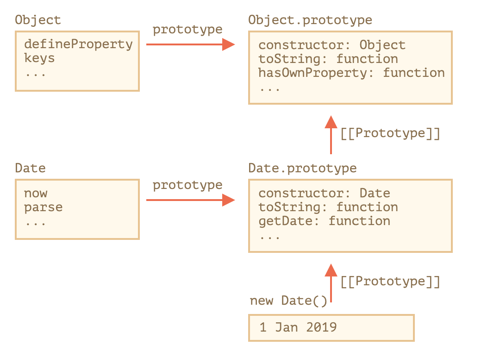

# Extending Built-in Classes
* Object
* Array
* ...

## terminology
* a extends b
  * a inherited from b
  * a is inheritor
  * inherited b 

## Build-in methods
* `arr.consturtor === PowerArray`
* Build-in methods `filter`
  * user constructor of PowerArray
  * return instance of inheritor


```js

class PowerArray extends Array {
  addAll() {
    let res = 0
    this.forEach((v) => {
      res = res + v;
    })
    return res;
  }
}

let arr = new PowerArray(1,2,3,4,5);

arr.addAll() // 15

let filteredArr = arr.filter((v) => {
  return v >= 3;
})
filteredArr.addAll() // 12


```

### [Symbol.species](https://developer.mozilla.org/en-US/docs/Web/JavaScript/Reference/Global_Objects/Symbol/species)
* use the Symbol.species to return the constructor that JavaScript will use internally to create new entities in map, filter and so on.


```js

class PowerArray extends Array {
  isEmpty() {
    return this.length === 0;
  }

  // built-in methods will use this as the constructor
  static get [Symbol.species]() {
    return Array;
  }
}

let arr = new PowerArray(1, 2, 5, 10, 50);
alert(arr.isEmpty()); // false

// filter creates new array using arr.constructor[Symbol.species] as constructor
let filteredArr = arr.filter(item => item >= 10);

// filteredArr is not PowerArray, but Array
alert(filteredArr.isEmpty()); // Error: filteredArr.isEmpty is not a function


```

* Other collections work similarly
  * Other collections, such as Map and Set, work alike. They also use Symbol.species.


## No Static Inheritance in built-ins

### Normal Inheritance

```js

class Animal {

}

class Rabbit extends Animal {

}

let rabbit = new Rabbit();

Rabbit.__proto__ === Animal; //true
Rabbit.prototype.__proto__ === Animal.prototype; //true
rabbit.__proto__.__proto__ === Animal.prototype; //true

```

### Built-ins's inheritance
* They don’t inherit statics from each other.


```js

Date.__proto__ === Object //false
Date.prototype.__proto__ === Object.prototype; // true


```


