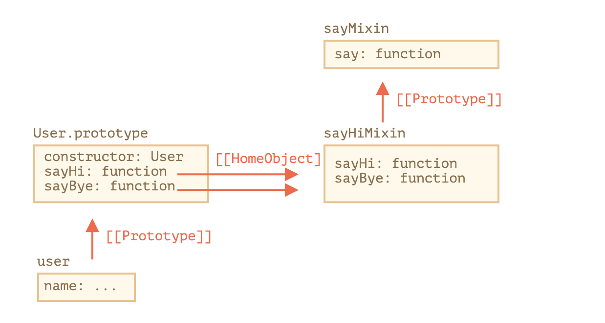

# Mixin

## Problem
* There can be only one [[Prototype]] for an object
* Class can only extends on Class

### Goal
* single class has two different behaviors from two different classes.
* single class wants a single specific functionality from another class.

### Solution
* Mixin

## Mixin Overview
* a class containing methods that can be used by other classes without a need to inherit from it.
* mixin provides methods that implement a certain behavior, but we do not use it alone, we use it to add the behavior to other classes.
* a little bit like HOC.
  * HOC enhance react component
  * Mixin enhance class
* caveat: Mixins may become a point of conflict if they accidentally overwrite existing class methods. So generally one should think well about the naming methods of a mixin, to minimize the probability of that.


## Mixin Examples

### Mixin Object + Inherited Class
* mixin only provide some functions as methods of prototypeObject of the class.

```js

// mixin
let sayHiMixin = {
  sayHi() {
    alert(`Hello ${this.name}`);
  },
  sayBye() {
    alert(`Bye ${this.name}`);
  }
};

// inherited class
class Person {

}

// usage:
class User extends Person {
  constructor(name) {
    this.name = name;
  }
}

// copy the methods
Object.assign(User.prototype, sayHiMixin);

// now User can say hi
new User("Dude").sayHi(); // Hello Dude!


```

### Mixin Object + Mixin's inherited Object
*  call to the parent method super.say() from sayHiMixin looks for the method in the prototype of that mixin, not the class.


```js


let sayMixin = {
  say(phrase) {
    alert(phrase);
  }
};

let sayHiMixin = {
  __proto__: sayMixin, // (or we could use Object.create to set the prototype here)

  sayHi() {
    // call parent method
    super.say(`Hello ${this.name}`); // (*)
  },
  sayBye() {
    super.say(`Bye ${this.name}`); // (*)
  }
};

class User {
  constructor(name) {
    this.name = name;
  }
}

// copy the methods
Object.assign(User.prototype, sayHiMixin);

// now User can say hi
new User("Dude").sayHi(); // Hello Dude!


```



## EventMixin

* steps
  * user triggers an event
  * handler handles event

* Three main elements
 1. trigger
  * `.trigger(name, [...data])`
  * generate an event
  * pass some arguments
 2. on
  * add handler
 3. off
  * remove handler


```js

let eventMixin = {
  _eventHandlers: undefined,

  on(eventName, handler) {
    if(!this._eventHandlers) {
      this._eventHandlers = {}
    }
    if(!this._eventHandlers[eventName]) {
      this._eventHandlers[eventName] = []
    }
    this._eventHandlers[eventName].push(handler);
  },

  off(eventName, handler) {
    let handlers = this._eventHandlers $$ this._eventHandlers[eventName];
    if(!handlers) return;
    for (let i = 0 ; i < handlers.length ; i++) {
      if (handlers[i] === handler) {
        handlers.splice(i--, 1);
      }
    }
  },

  trigger(eventName, ...args) {
    if (!this._eventHandlers || !this._eventHandlers[eventName]) {
      return null;
    }

    this._eventHandlers[eventName].forEach((handler) => {
      handler.apply(this, args);
    })
  }
}


class Menu {
  choose(value) {
    this.trigger('select', value);
  }
}

Object.assign(Menu.prototype, eventMixin);

let menu = new Menu();

let onHandler = (value) => {
  console.log(`user select ${value}`);
}
menu.on('select', onHandler);

menu.choose('steak');

```
