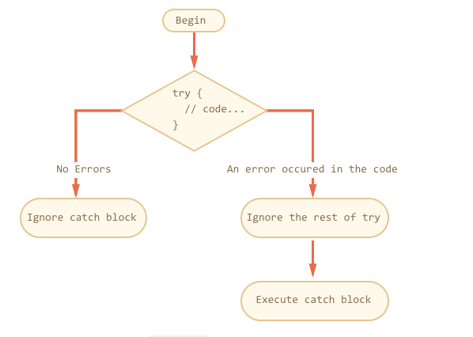

## Overview
* Usually script dies immediately if it run into error.
* try...catch help you to catch errors and do something for it.


## syntax
```js
try {

  // code...

} catch (err) {

  // error handling

}

```




## Note

### Only Works for Runtime Errors
* try...catch only works for runtime errors
  * it only works on valid and successfully running javascript.
* It can not detect syntax error.
* it only handle **runtime errors === exceptions**.

```js
// if javascript run through following code, the script just die.

try {
  // {{{{{{{{{{{{
} catch(e) {
  alert("The engine can't understand this code, it's invalid");
}
```
## Works Synchronously
* The try..catch can not catch the error for the inner setTimeout function.
  * Because of development loop
  * setTimeout is in another call stack, when javascript engine run through the main script(main stack) and pop out the setTimeout stack. The stack that try catch belongs to has been poppped out to no where.

```js

try {
  setTimeout(function() {
    noSuchVariable; // script will die here
  }, 1000);
} catch (e) {
  alert( "won't work" );
}

```

* solution

```js

setTimeout(function() {
  try {
    noSuchVariable; // try..catch handles the error!
  } catch {
    alert( "error is caught here!" );
  }
}, 1000);

```

## Error Object
* properties
  * name
    * new Error Object: Error
    * undefined name: ReferencesError
  * message
    * text
  * stack
    * current call stack
    * a string with information about the sequence of nested calls that led to the error. Used for debugging purposes.

```js

try {
  lalala; // error, variable is not defined!
} catch(err) {
  alert(err.name); // ReferenceError
  alert(err.message); // lalala is not defined
  alert(err.stack); // ReferenceError: lalala is not defined at ...

  // Can also show an error as a whole
  // The error is converted to string as "name: message"
  alert(err); // ReferenceError: lalala is not defined
}

```

### Omit Catch Binding

```js
try {
  // ...
} catch {
  // error object omitted
}

```

## Ubiquitous Case
* JSON.parse(json);
* You get a json string from server.
* In the example we just print out all error related messages. In real life, we can do follwoing:
  * send a new request
  * show alternative string.
  * show error pop up

```js

let jsonString = "{ borken json }";

try {
  let user = JSON.parse(jsonString);
  console.log(user.name);

} catch (err) {
  console.log(err.name);
  console.log(err.message);
  console.log(err.stack)
}


```


## Throwing Our Own Errors
* In following example, javascript will see no wrong in it. However we don't want undefined user.name.
* We want to handle all errors in catch in once.

```js

let json = '{ "age": 30 }'; // incomplete data

try {

  let user = JSON.parse(json); // <-- no errors
  alert( user.name ); // no name!

} catch (e) {
  alert( "doesn't execute" );
}

```

### Solution: Throw Operator
* You can throw
  * primitive: number, string
  * object - with following properties (we should prefer object)
    * name
    * message
* Built-in constructor (object)
  * example:
    * Error
    * SyntaxError
    * ReferenceError
  * overview :
    * name property is exactly the name of the constructor.
    * And message is taken from the argument.


```js
// throw <error object>


let error = new Error(message);
// or
let error = new SyntaxError(message);
let error = new ReferenceError(message);

throw error
```


```js

let error = new Error("Things happen o_O");

alert(error.name); // Error
alert(error.message); // Things happen o_O

```


```js

try {
  JSON.parse("{ bad json o_O }");
} catch(e) {
  alert(e.name); // SyntaxError
  alert(e.message); // Unexpected token o in JSON at position 0
}

```


```js

let json = '{ "age": 30 }'; // incomplete data

try {

  let user = JSON.parse(json); // <-- no errors

  if (!user.name) {
    throw new SyntaxError("Incomplete data: no name"); // (*)
  }

  alert( user.name );

} catch(e) {
  alert( "JSON Error: " + e.message ); // JSON Error: Incomplete data: no name
}

```

## Rethrow
* We handle what we predict and throw those unpredictable error
  * outer try catch will handle it
  * script die ???? (I don't think this is a good way)

```js
let json = '{ "age": 30 }'; // incomplete data
try {

  let user = JSON.parse(json);

  if (!user.name) {
    throw new SyntaxError("Incomplete data: no name");
  }

  blabla(); // unexpected error

  alert( user.name );

} catch(e) {

  if (e.name == "SyntaxError") {
    alert( "JSON Error: " + e.message );
  } else {
    throw e; // rethrow (*)
  }

}


/* outer try catch */

function readData() {
  let json = '{ "age": 30 }';

  try {
    // ...
    blabla(); // error!
  } catch (e) {
    // ...
    if (e.name != 'SyntaxError') {
      throw e; // rethrow (don't know how to deal with it)
    }
  }
}

try {
  readData();
} catch (e) {
  alert( "External catch got: " + e ); // caught it!
}
```

## try...catch...finally

* In both cases, they both run into finally
  * after try, if there were no errors,
  * after catch, if there were errors.

```js

// If you answer “Yes” to “Make an error?”, then try -> catch -> finally.
//  If you say “No”, then try -> finally.

try {
  alert( 'try' );
  if (confirm('Make an error?')) BAD_CODE();
} catch (e) {
  alert( 'catch' );
} finally {
  alert( 'finally' );
}

```

### What is finally for
* finalize any case
  * example: measure the time that function take to run all statements.
* Example: measure the time that fib function take
  * cases:
    1. successful
    2. fail
* finally run before return or **rethrow** new Error.
 * check the example on [Task section](https://javascript.info/try-catch)

```js

let num = +prompt("Enter a positive integer number?", 35)

let diff, result;

function fib(n) {
  if (n < 0 || Math.trunc(n) != n) {
    throw new Error("Must not be negative, and also an integer.");
  }
  return n <= 1 ? n : fib(n - 1) + fib(n - 2);
}

let start = Date.now();

try {
  result = fib(num);
} catch (e) {
  result = 0;
} finally {
  diff = Date.now() - start;
}

alert(result || "error occured");

alert( `execution took ${diff}ms` );

```

### Runs Before Return
```js


function func() {

  try {
    return 1;

  } catch (e) {
    /* ... */
  } finally {
    alert( 'finally' );  // the line run before return
  }
}

alert( func() ); // first works alert from finally, and then this one

```

## Scope
* if you declare variable inside try-catch code block, the variable can only be accessed inside the code block.

## Global Error Catcher
* to log error


```js
window.onerror = function(message, url, line, col, error) {
  // ...
};

//
// message
// Error message.
// url
// URL of the script where error happened.
// line, col
// Line and column numbers where error happened.
// error
// Error object.

<script>
  window.onerror = function(message, url, line, col, error) {
    alert(`${message}\n At ${line}:${col} of ${url}`);
  };

  function readData() {
    badFunc(); // Whoops, something went wrong!
  }

  readData();
</script>

```
