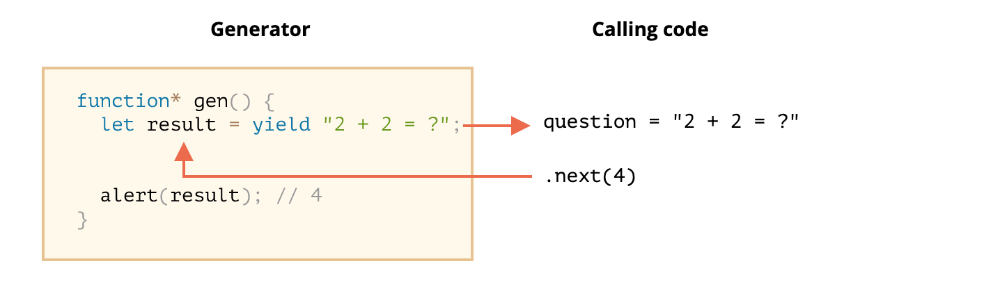

# Generators

## Overview
* a function
* return two kind of stuffs
  1. single value
  2. nothing
* Generators can return (“yield”) multiple values, one after another, on-demand. They work great with iterables, allowing to create data streams with ease.


```js

function* generateSequence() {
  yield 1;
  yield 2;
  return 3;
}


```

## Generator Functions
* Invoked generator functions and reach the yield
  * when javascript engine reach the yield, it will not execute the rest of the statements
  * the function return special object: **generator object**

```js


function* generateSequence() {
  yield 1;
  yield 2;
  return 3;
}

// "generator function" creates "generator object"
let generator = generateSequence();
alert(generator); // [object Generator]

```

#### generator object
* three main methods
  1. next
  2. return
  3. throw
* next
  * return an object with two properties
    1. value: the yielded value.
    2. done: true if the function code has finished, otherwise false.

* if you call next method the `generateSequence` will be executed and run to the next yield


```js


function* generateSequence() {
  yield 1;
  yield 2;
  return 3;
}

// "generator function" creates "generator object"
let generator = generateSequence();
let test = generator.next();  // test === { value: 1, done: false }
test = generator.next();  // test === { value: 2, done: false }
test = generator.next();  // test === { value: 3, done: true }
test = generator.next();  // test === undefined

```


#### Syntax
* `function* f(…)`|| `function *f(…)`
  * Both syntaxes are correct.
  * But usually the first syntax is preferred


## Generators are iterable
* generator can be itrated by `for...of`

```js

function* generateSequence() {
  yield 1;
  yield 2;
  return 3;
}

let generator = generateSequence();

for(let value of generator) {
  alert(value); // 1, then 2
}

```

* the `for...of` iteration ignores the last value, when done: true

```js

function* generateSequence() {
  yield 1;
  yield 2;
  yield 3;
}

let generator = generateSequence();

for(let value of generator) {
  alert(value); // 1, then 2, then 3
}

```

* As generators are iterable, we can call all related functionality, e.g. the **spread operator ...**

```js

function* generateSequence() {
  yield 1;
  yield 2;
  yield 3;
}

let sequence = [0, ...generateSequence()];

alert(sequence); // 0, 1, 2, 3

```

## Using generators for iterables

```js

// the object is iterable
const range = {
  from: 0,
  to: 5,
  [Symbol.iterator]() {

    // this object is iterator
    return {
      current: this.from,
      last: this.to,
      next() {
        if (this.current <= this.last) {
          return {
            done: false,
            value: this.current++,
          };
        } else {
          return {
            done: true,
          }
        }
      }
    }
  }
}

const rangeWithGenerator = {
  from: 0,
  to: 5,
  *[Symbol.iterator]() {
    let currentValue = 0;
    for (let i = this.from; currentValue <= this.to; currentValue++) {
      yield currentValue;
    }
  }
}


```
## Generator composition

```js


function* generateSequence(start, end) {
  for (let i = start; i <= end; i++) yield i;
}

function* generatePasswordCodes() {

  // 0..9
  yield* generateSequence(48, 57);

  // A..Z
  yield* generateSequence(65, 90);

  // a..z
  yield* generateSequence(97, 122);

}

let str = '';

for(let code of generatePasswordCodes()) {
  str += String.fromCharCode(code);
}

alert(str); // 0..9A..Za..z


```

## **Yield is two-way road (In and Out)**
* two way road
  1. returns the result outside
  2. pass the value inside the generator.
* outer code may pass a value into the generator, as the result of yield


#### example #1

```js


function* gen() {
  // Pass a question to the outer code and wait for an answer
  let result = yield "2 + 2 = ?"; // (*)

  alert(result);
}

let generator = gen();

let question = generator.next().value; // <-- yield returns the value

generator.next(4); // --> pass the result into the generator


```




#### Steps

1. The first call generator.next() is always without an argument. It starts the execution and returns the result of the first yield "2+2=?". At this point the generator pauses the execution (still on that line).

2. Then, as shown at the picture above, the result of yield gets into the question variable in the calling code.

3. On generator.next(4), the generator resumes, and 4 gets in as the result: let result = 4.1


#### Async

```js

function* gen() {
  // Pass a question to the outer code and wait for an answer
  let result = yield "2 + 2 = ?"; // (*)

  alert(result);
}

let generator = gen();

let question = generator.next().value; // <-- yield returns the value

// resume the generator after some time
setTimeout(() => generator.next(4), 1000);

```

#### example #2

```js


function* gen() {
  let ask1 = yield "2 + 2 = ?";

  alert(ask1); // 4

  let ask2 = yield "3 * 3 = ?"

  alert(ask2); // 9
}

let generator = gen();

alert( generator.next().value ); // "2 + 2 = ?"

alert( generator.next(4).value ); // "3 * 3 = ?"

alert( generator.next(9).done ); // true

```


## generator.throw


```js

function* gen() {
  try {
    let result = yield "2 + 2 = ?"; // (1)

    alert("The execution does not reach here, because the exception is thrown above");
  } catch(e) {
    alert(e); // shows the error
  }
}

let generator = gen();

let question = generator.next().value;

generator.throw(new Error("The answer is not found in my database")); // (2)


```
* If we don’t catch it, then just like any exception, it “falls out” the generator into the calling code.
  * If we don’t catch the error there, then, as usual, it falls through to the outer calling code (if any) and, if uncaught, kills the script.

```js

function* generate() {
  let result = yield "2 + 2 = ?"; // Error in this line
}

let generator = generate();

let question = generator.next().value;

try {
  generator.throw(new Error("The answer is not found in my database"));
} catch(e) {
  alert(e); // shows the error
}


```
