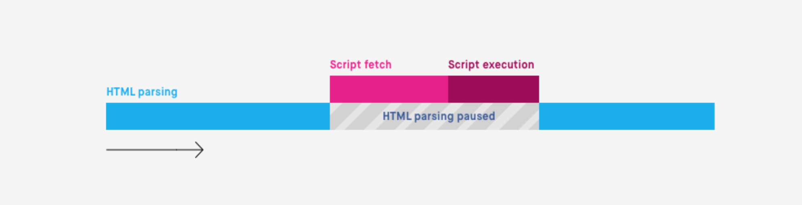
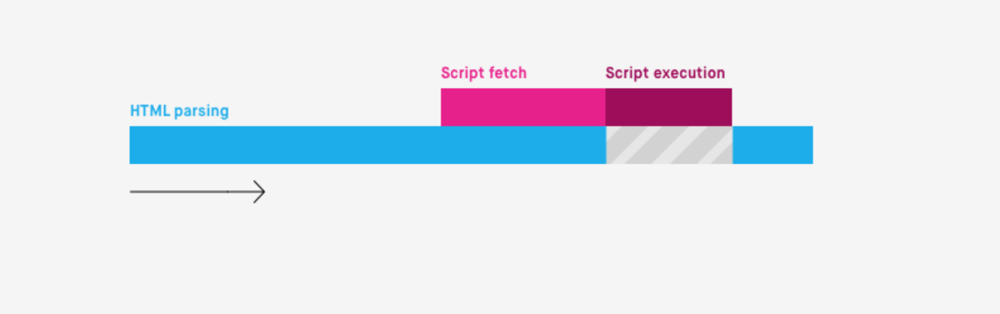
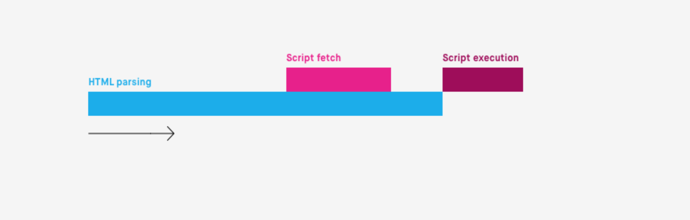
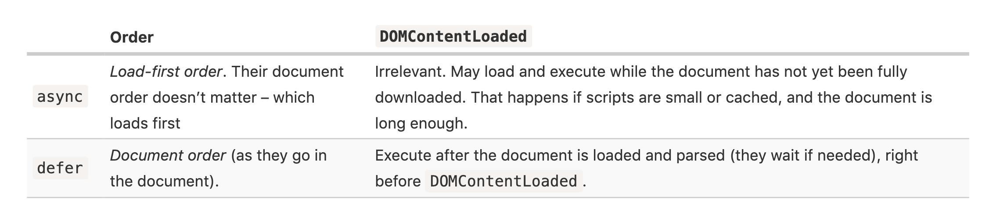

# Script Async Defer

## Overview
* script become larger recently
* when browser loads HTML and comes across a <script>...</script> tag
  * stop process DOM and start to load/execute script
  * scenario
    1. browser load html
    2. start to build DOM
    3. encounter script statement in html
    4. stop building DOM
    5. download, execute the script
    6. start building DOM again

#### Issues
* caused by putting big script at top of html file
  1. Scripts can’t see DOM elements below them, so can’t add handlers etc.
  2. If there’s a bulky script at the top of the page, it “blocks the page”. Users can’t see the page content till it downloads and runs

  ```html
  <p>...content before script...</p>

  <script src="https://javascript.info/article/script-async-defer/long.js?speed=1"></script>

  <!-- This isn't visible until the script loads -->
  <p>...content after script...</p>

  ```


## Solution For Issues

#### Work Around
* put a script at the bottom of the page
  * benefits
    * it doesn’t block the page content from showing
  * [downsides](https://stackoverflow.com/questions/2451417/whats-pros-and-cons-putting-javascript-in-head-and-putting-just-before-the-bod)
    * the browser notices the script (and can start downloading it) only after it downloaded the full HTML document
      * For long HTML documents, that may be a noticeable delay.

```HTML
<body>
...all content is above the script...

<script src="https://javascript.info/article/script-async-defer/long.js?speed=1"></script>
</body>
```


#### Defer
* features
  * process html
  * load script in background
  * run the script after load it
    * after html-parsing is done

* The defer attribute is only for external scripts
  * The defer attribute is ignored if the `<script>` tag has no src.

* scripts with the defer attribute
  * will execute in the order in which they appear in the document
  * never block the page
  * always execute when the DOM is ready, but before DOMContentLoaded event

```HTML

<p>...content before scripts...</p>

<script>
  document.addEventListener('DOMContentLoaded', () => alert("DOM ready after defer!")); // (2)
</script>

<script defer src="https://javascript.info/article/script-async-defer/long.js?speed=1"></script>

<p>...content after scripts...</p>

```

* order
  * The small script downloads first, runs/executes second
    * Browsers scan the page for scripts and download them in parallel, to improve performance. So in the example above both scripts download in parallel. The small.js probably makes it first
    * But the specification requires scripts to execute in the document order, so it waits for long.js to execute.

```HTML

<script defer src="https://javascript.info/article/script-async-defer/long.js"></script>
<script defer src="https://javascript.info/article/script-async-defer/small.js"></script>

```

* use case
  * [jQuery](https://alligator.io/html/defer-async/#targetText=Async%20vs%20Defer&targetText=With%20defer%2C%20the%20file%20gets,order%20as%20they%20are%20called.&targetText=A%20good%20strategy%20is%20to,async%20isn't%20an%20option.)
    * prevent scripts from blocking html rendering
      * defer for jQuery script
      * defer for all scripts that depend on jQuery
    * remember put jQuery script before the rest scripts that depend on jQuery
      * defer-scripts still execute in position order


#### async
* features
  * The page doesn’t wait for async scripts, the contents is processed and displayed
  * DOMContentLoaded and async scripts don’t wait each other
  * Other scripts don’t wait for async scripts, and async scripts don’t wait for them
  * load-first
    * the script which finish loading first will run first no matter where does it locates

```HTML

<p>...content before scripts...</p>

<script>
  document.addEventListener('DOMContentLoaded', () => alert("DOM ready!"));
</script>

<script async src="https://javascript.info/article/script-async-defer/long.js"></script>
<script async src="https://javascript.info/article/script-async-defer/small.js"></script>

<p>...content after scripts...</p>

```

* use case
  * an independent third-party script
    * our scripts do not depend on the third-party script and the third-part script also do not depend on our scripts
    * example
      * google analytics
      * appier
      * tracking scripts

```html

<!-- Google Analytics is usually added like this -->
<script async src="https://google-analytics.com/analytics.js"></script>

```


## Dynamic Scripts

* add a script dynamically using javasceipt

```js

let script = document.createElement('script');
script.src = "/article/script-async-defer/long.js";
document.body.append(script); // (*)

```

* The script starts loading as soon as it’s appended to the document `(*)`
* Dynamic scripts behave as “async” by default
  * load-first

*  change the load-first order into the document order

```js

let script = document.createElement('script');
script.src = "/article/script-async-defer/long.js";

script.async = false;

document.body.append(script);

```

## [Summary](http://javascript.info/script-async-defer#summary)


## Critical Rendering Path
* The sequence the browsers needs to run through for the initial paint

#### 6 steps
1. Constructing the DOM Tree
  * can be rendered part by part
2. Constructing the CSSOM Tree
  * render blocking resource
3. Running JavaScript
  * parse blocking resource
4. Creating the Render Tree
  * a combination of both the DOM and CSSOM
  * display: none will not be created
5. Generating the Layout
  * viewport
    * `<meta name="viewport" content="width=device-width,initial-scale=1">`
6. Painting
  * How much time the paint step takes depends on the size of the DOM, as well as what styles are applied


## Asynchronous vs Deferred JavaScript

* javascript is parser blocking resource
  * problem
    * large and big amount of javascript files
      * block paint even if the document(HTML) is not actually dependent on those files
* Three scenarios
  1. Normal Execution

  

  2. Async Execution

  

  3. Defer Execution

  

### When and Where to use normal/async/defer

#### Where is the `<script>` element located?
*  If an externally sourced JavaScript file is placed right before the closing `</body>` element, it becomes much less pertinent to use an async or defer attribute

#### Is the script self-contained?
* independent -> async
  * GA, Ads, Appier

#### Does the script rely on a fully parsed DOM?
* DOM must be fully parsed before the script should be executed
  * script file contains functionality that requires interaction with the DOM
  * have a dependency on another file included on the page
* solutions
  1. put the script at the bottom of the page
  2. defer


#### Is the script a (small) dependency?
* case
  * script is relative small
  * script is depended on or by other files
* solution
  * useful to have it defined inline
    * trivial delayed
    * depended by others


## Summary




## My Notes
* defer
  * script depends on whole parsed DOM
  * document-order
* async
  * independent script
  * load-first order


## References
[Critical Rendering Path](https://bitsofco.de/understanding-the-critical-rendering-path/)
[Async vs. Defer](https://bitsofco.de/async-vs-defer/)

## To Read
1. https://stackoverflow.com/questions/436411/where-should-i-put-script-tags-in-html-markup#targetText=You%20can%20place%20most%20of,(ideally%20in%20head%20tag).&targetText=Before%20the%20end%20of%20the,to%20prevent%20and%20UI%20blocking.
2. https://teamtreehouse.com/community/best-practice-where-to-include-your-script-tags
3. search: https://www.google.com/search?rlz=1C5CHFA_enTW861TW861&sxsrf=ACYBGNTPKB6nEvXzCl4ezuJjljyWUZ7lDQ%3A1571274505878&ei=Cb-nXdqdNem4mAWg-pnYDg&q=script+location+in+html+best+practices&oq=script+location+in+html+best+practices&gs_l=psy-ab.3..33i299l2.4221.10669..10797...2.2..1.208.2548.39j0j1......0....1..gws-wiz.......0i71j35i39j0i273j0j0i67j0i131j0i20i263j0i203j0i22i30j33i22i29i30j33i160j33i10.XgQtmrSbpa0&ved=0ahUKEwiaxpHWjaLlAhVpHKYKHSB9BusQ4dUDCAs&uact=5
