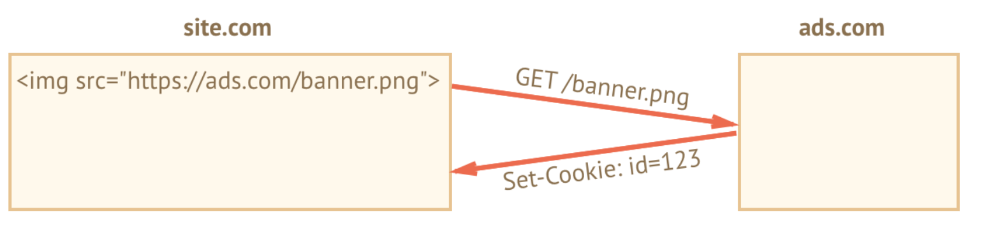

## Overview
* small string data that store in browser directly
* part of http protocol
* most of time, it is set by web server.
* most of time, it is for authentication
* javascript: document.cookie to access

## Authentication Steps
1. Upon sign in, the server uses Set-Cookie HTTP-header in a response to set a cookie with “session identifier”.
2. The browser stores the cookie.
3. Next time when the request is set to the same domain, the browser sends the over the net using Cookie HTTP-header.
4. So the server knows who made the request.


## Read Cookie by javascript
* document.cookie
  * key value pair
  * each cookie is separated by `;`
  * encodeURIComponent for some characters

```js
document.cookie = "user=John"; // update only cookie named 'user'
alert(document.cookie); // show all cookies

/* to keep a valid name */
// special values, need encoding
let name = "<>";
let value = "="

// encodes the cookie as %3C%3E=%3D
document.cookie = encodeURIComponent(name) + '=' + encodeURIComponent(value);

alert(document.cookie); // ...; %3C%3E=%3D

```

## Limitation
* max-size: 4kb
* The total number of cookies per domain is limited to 20+


## Options/Attributes
### path
  * path=/mypath
    * accessible:
      * /mypath
      * /mypayh/*
    * cant access:
      * /page
      * /mypathpage

### domain
  * Default: cookie is accessible only at the domain that set it.
    * cookie set by ```site.com```
      * `other.com` can not access
      * `forum.site.com` the sub-domain can not access either.
  * Grant sub-domain authority.
    * set cookie domain explicitly.

      ```js
      // at site.com, make the cookie accessible on any subdomain:
      document.cookie = "user=John; domain=site.com"

      // at forum.site.com
      alert(document.cookie); // with user

      *
      ```

### expires, max-age
* no (expires || max-age)
  * browser close => the cookie is gone
  * such cookie called session cookie

* set expire || max-age
  * cookie will prevail even you close the browser.
  * expire
    * expire at specific time

    ```js
    expires=Tue, 19 Jan 2038 03:14:07 GMT
    // +1 day from now
    let date = new Date(Date.now() + 86400e3);
    date = date.toUTCString();
    document.cookie = "user=John; expires=" + date;
    ```
  * max-age
    * specifies the cookie expiration in seconds
      * number of seconds from the current moment,
      * zero/negative for immediate expiration (to remove cookie)

    ```js
    // cookie will die +1 hour from now
    document.cookie = "user=John; max-age=3600";

    // delete cookie (let it expire right now)
    document.cookie = "user=John; max-age=0";
    ```

### secure
* Default: cookie set by `https://site.com` can also access by `http://site.com`

```js

// set the cookie secure (only accessible if over HTTPS)
document.cookie = "user=John; secure";

```

* set secure flag to protect sensitive cookie.
  * set by https can only access when user use https protocol

### samesite
  * a flag that use to prevent XSRF (Cross-Site-Forgery-Request)

### What is CSRF/XSRF
  * user has to maintain login status (possess sessionid in cookie) for specific vulnerable website(bank)
  * get
    1. hacker exploit social engineering to send you a fake link.
    2. user click on malicious link and send a get request to bank to do transaction
      * https://bacnk.com?transfer=10000&to=hacker
  * post
    1. hacker exploit social engineering to send an email to user
    2. user click on content of email and load the malicious website that served by hacker's server.
    3. the page load a form automatically and submit the form automatically (post request) to bank website.
      * now you also make a transaction to transfer money to hacker

    ```html

    <body onload="document.csrf.submit()">

    <form action="http://example.com/transfer" method="POST" name="csrf">
    	<input type="hidden" name="amount" value="1000000">
    	<input type="hidden" name="account" value="Fred">
    </form>


    ```

### samesite=strict, samesite without value
 * cookie will never sent if user comes from outside the site.
 * only the website which set cookie will send the samesite cookie
 * only send cookie from the request originated from the website that set the cookie.
  * on evil page
    * click on the malicious link will not send the cookie
    * what if I copy paste the link to browser and surf the website directly ? (transaction make by get request)
      1. user usually don't do that
      2. In practice, bank company don't use get request to do transaction.
 * bad for user experience
    1. say the website has an endpoint (get request) for user to request and maintain login status and basic account data.
    2. there is an article about the website and has an external link to the website.
    3. Say originally, user has login status of the website. But now if user click on the link he will in logout status.

### samesite=lax
  * forbids the browser to send cookies when coming from outside the site but with an exception
    * exception
      1. the http method is safe
        * The method should only read data rather then modify data. (Get not Post)
        * [safe methods](https://tools.ietf.org/html/rfc7231#section-4.2.1)
      2. The operation performs top-level navigation (changes URL in the browser address bar)
        * iframe is not top-level
    * good for user experience
      * same example, as a developer you can create two kind of cookies. loses cookie for get request and strict cookie for post request. Now, those external links can access the website through get request to get some basic data. But those transaction process only can be done by post request and require user to do such request at the website origin.

### Drawback
  * samesite cookie only support by modern website.
    * use CSRF token

### httpOnly
* only server can set it through Set-Cookie
* forbids any JavaScript access to the cookie.
  * can not use ```document.cookie```
  * protect from certain attacks when a hacker injects his own Javascript code into a page and waits for a user to visit that page.
  * prevent hacker implements XSS


## Appendix
### Third Party Cookie
* used for tracking and ads services
* bound to originating domain
* ads.com can track the same user between different sites,
* How to do it
  1. a page `site.com` loads an banner from another site: ``.

  2. ads.com server
    * set Set-Cookie header
      * id=1234.
      * from ads.com domain
      * only be visible at ads.com:

  

  3. user access ads.com
      * ads.com get the cookie(id=1234).
      * ads.com recognize the user

  

  4. user access other.com which also has ``
      * now user sent the cookie to ads.com again
      * ads.com recognize the user

  

#### Privacy Issue
* chrome: allow to disable third party cookie
* safari: does not allow third-party cookies at all.
* firefox: with a “black list” of third-party domains where it blocks third-party cookies

#### Third Party's Script sets cookie
* the cookie is not third-party cookie

1.  we surf a page `site.com` which load a script from third-part domain
  * `<script src="https://google-analytics.com/analytics.js">`
  * script uses document.cookie to set a cookie
2. the cookie belongs to the domain `site.com`.

### General Data Protection Regulation (GDPR)
* A regulation in Europe

* Several rules for website to respect user's privacy.

* on rule about cookie
  * require an explicit permission for tracking cookies from a user
  * only about tracking/identifying cookies.
  * the cookies about general information is okay, but if the cookie is about tracking user id or authentication session then it needs user's permission.

* example


1. If a website wants to set tracking cookies only for authenticated users.
  * To do so, the registration form should have a checkbox like “accept the privacy policy”, the user must check it, and then the website is free to set auth cookies.

2. If a website wants to set tracking cookies for everyone.
  * To do so legally, a website shows a modal “splash screen” for newcomers, and require them to agree for cookies. Then the website can set them and let people see the content. That can be disturbing for new visitors though. No one likes to see “must-click” modal splash screens instead of the content. But GDPR requires an explicit agreement.


## Summary


### document.cookie provides access to cookies

* write operations modify only cookies mentioned in it.
* name/value must be encoded (encodeURIComponent).
* one cookie up to 4kb, 20+ cookies per site (depends on a browser).


### Cookie options:

* `path=/`, by default current path, makes the cookie visible only under that path.
* `domain=site.com`, by default a cookie is visible on current domain only, if set explicitly to the domain, makes the cookie visible on subdomains.
* `expires/max-age` set cookie expiration time, without them the cookie dies when the browser is closed.
* `secure` makes the cookie HTTPS-only.
* `samesite` forbids browser to send the cookie with requests coming from outside the site, helps to prevent XSRF attacks.

### Additionally:

* Third-party cookies may be forbidden by the browser, e.g. Safari does that by default.
* When setting a tracking cookie for EU citizens, GDPR requires to ask for permission.

## References
[samesite=strict](https://medium.com/compass-security/samesite-cookie-attribute-33b3bfeaeb95)
