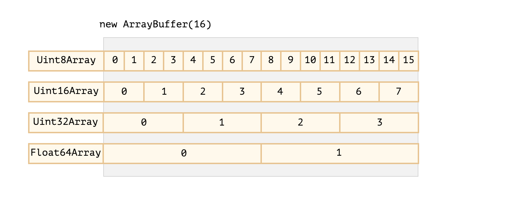

# Array Buffer && Binary Arrays


## Preview
* when do we need Binary data (both can be done by javascript)
    1. In web-development: download, upload create files
    2. image processing
        * resize
        * change resolution

* classes that carry binary data
    1. ArrayBuffer
    2. Uint8Array (unsigned integer)
    3. DataView
    4. Blob
    5. File
    6. ,etc.


## Array Buffer Overview
* a reference to a fixed-length contiguous memory area

```js
let myBuffer = new ArrayBuffer(16);
console.log(myBuffer.byteLength)

```

* example
    1. allocate a 16-byte contiguous memory
    2. fill the allocated memory with zeros


#### **caveat:** ArrayBuffer is not an Array

* main differences
    1. fixed-length
    2. takes exactly that much space in memory
    3. To access individual byte, another **view object** is needed not `myBuffer[index]`

* ArrayBuffer is a memory area, only see data as raw sequence of bytes and has no idea how to interpret data

* view object
    * used for interpreting data which stored inside ArrayBuffer.


## View Object

* classes (typedArray) that used to create view object
  * Uint8Array – treats each byte in ArrayBuffer as a separate number, with possible values are from 0 to 255 (a byte is 8-bit, so it can hold only that much). Such value is called a “8-bit unsigned integer”.
  * Uint16Array – treats every 2 bytes as an integer, with possible values from 0 to 65535. That’s called a “16-bit unsigned integer”.
  * Uint32Array – treats every 4 bytes as an integer, with possible values from 0 to 4294967295. That’s called a “32-bit unsigned integer”.
  * Float64Array – treats every 8 bytes as a floating point number with possible values from 5.0x10-324 to 1.8x10308.





```js

let myBuffer = new ArrayBuffer(16);  // allocate 16-byte continguous memory area

let view8 = new Uint8Array(myBuffer) // view memory area as 8 bits a slot. Each slot has 1 byte
let view16 = new Uint16Array(myBuffer); // view memory area as 16 bits a slot. Each slot has 2 byes
let view32 = new Uint32Array(myBuffer) // view memory area as 32bits a slot. Each slot has 4 bytes

console.log(view8.length) // 16 slots
console.log(view8.byteLength); // 16-byte contiguous memory area.

console.log(view16.length) // 8 slots
console.log(view16.byteLength); // 16-byte contiguous memory area.

console.log(view32.length) // 4 slots
console.log(view32.byteLength); // 16-byte contiguous memory area.

view16[0] = 65537; // 65535 -> 65535, 65546 -> 0, 65536 -> 1

for (let i of view16) {
  console.log(i);
}


```


### TypedArray
* list of typed array
    * Uint8Array, Uint16Array, Uint32Array – for integer numbers of 8, 16 and 32 bits.
    * Uint8ClampedArray – for 8-bit integers, “clamps” them on assignment (see below).
    * Int8Array, Int16Array, Int32Array – for signed integer numbers (can be negative).
    * Float32Array, Float64Array – for signed floating-point numbers of 32 and 64 bits.
* the object instantiated by Typed Array has same set of methods and properties
* much more like regular arrays: have indexes and iterable
* 5 variants of arguments:
    ```js
    new TypedArray(buffer, [byteOffset], [length]);
    new TypedArray(object);
    new TypedArray(typedArray);
    new TypedArray(length);
    new TypedArray();
    ```


* check each variant: http://javascript.info/arraybuffer-binary-arrays#typedarray
    * TypedArray(typedArray)
    ```js
      let arr16 = new Uint16Array([1, 255, 256, 1000]);
      let arr8 = new Uint8Array(arr16);

      console.log(arr16[0]) // 1
      console.log(arr16[1]) // 255
      console.log(arr16[2]) // 256
      console.log(arr16[3]) // 1000
      console.log(arr8[0]) // 1
      console.log(arr8[1]) // 255
      console.log(arr8[2]) // 0 <- out of bounds, overflow // modulo 2^8 is saved
      console.log(arr8[3]) // 232 // modulo 2^8 is saved

    ```

### Conclusion
* view object only created by passing ArrayBuffer as argument of TypedArray constructor.

* access `ArrayBuffer` from typedArray object (view object)
    * arr.buffer – references the ArrayBuffer.
    * arr.byteLength – the length of the ArrayBuffer.

* overflow
    * uint8array[0] = 256
      * get 0 -> out of bounds, overflow -> modulo 2^8 is stored
          * 256 % 256 -> 0
          * 257 % 256 -> 1


## [TypedArray Methods](http://javascript.info/arraybuffer-binary-arrays#typedarray-methods)

## [DataView -  “untyped” view](http://javascript.info/arraybuffer-binary-arrays#typedarray-methods)


## Tasks

```js

const bufferConcator = (arrays) => {

  let totalLength = arrays.reduce((acc, eachArray) => {
    return acc + eachArray.length;
  }, 0);

  if (!arrays.length) return null;

  let result = new Uint8Array(totalLength);
  let lengthOffset = 0;
  for (let array of arrays) {
    result.set(array, lengthOffset);
    lengthOffset += array.length;
  }
  return result
}

let binaryArrayOne = new Uint8Array([255, 255, 255, 255]);
let binaryArraytwo = new Uint8Array([0, 1, 2, 3]);
let binaryArraythree = new Uint8Array([256, 257, 258, 259]);

const result = bufferConcator([binaryArrayOne, binaryArraytwo, binaryArraythree])

console.log(result)


```
