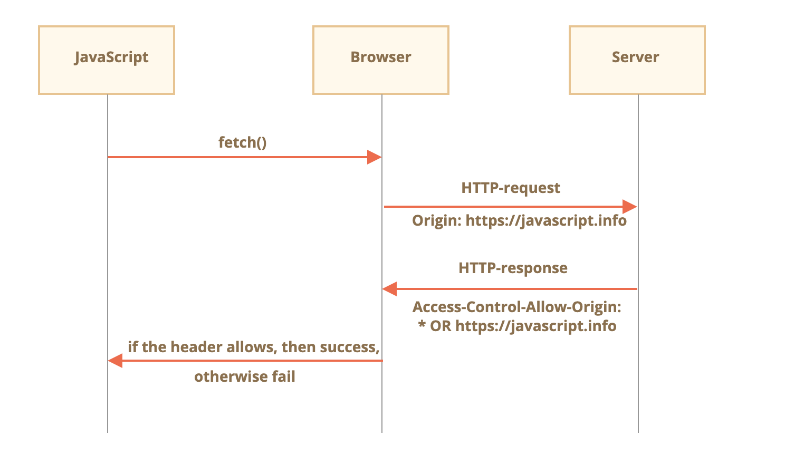
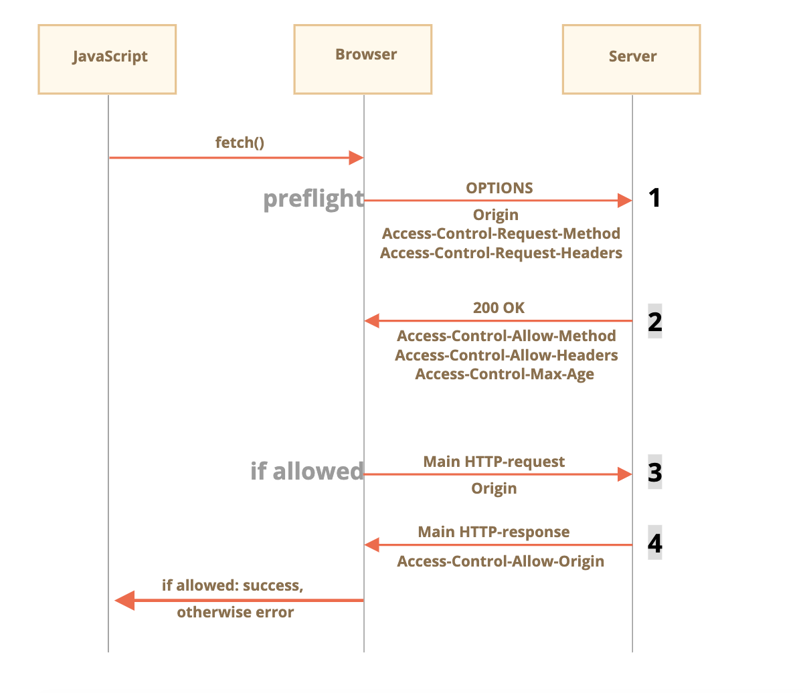

# Fetch CORS


## Cross Origin Resource Sharing
* Origin: protocol + domain + port
* Cross-origin:
    * send reauest from a origin to another domain (even a subdomain) or protocol or port – require special headers from the remote side.

## Why we need CORS
* increase security
* to adapt to same origin policy
    * in old time, there is a basic browser security mechanism: Same origin policy
        * example: an evil script from website hacker.com could not access user’s mailbox at website gmail.com
        * Problem: web development has advanced for years, and developers need send request to different origins. (restAPI)

## Solutions for work around same origin policy


#### Form
* submit form to iframe(prevent redirection/refresh ???)
* postMessage to communicate data between iframe and the parent page

```html

<!-- form target -->
<iframe name="iframe"></iframe>

<!-- a form could be dynamically generated and submited by JavaScript -->
<form target="iframe" method="POST" action="http://another.com/…">
  ...
</form>

```

#### JSONP (Scripts)

1. client side declare a global function

```js

function gotWeather({ temperature, humidity }) {
  alert(`temperature: ${temperature}, humidity: ${humidity}`);
}

```


2. make a script tag and request data from sever (different origin)


```js

let script = document.createElement('script');
script.src = `http://another.com/weather.json?callback=gotWeather`;
document.body.append(script);

```


3. implement the generation of declared global function on server side.

* when server receive the request from the client, sever script generate the function `gotWeather` dynamically in the returned script. Then the client can receive such function `gotWeather`.

```js

// The expected answer from the server looks like this:
gotWeather({
  temperature: 25,
  humidity: 78
});

```


#### CORS
* Implement through specific request and response headers.


## CORS
* two types
    1. simple request
        * can be made with a `<form>`  or a `<script>`, without any special methods.
    2. preflighted request

### Simple Request

* simple method
    1. get
    2. post
    3. head: pre-request for big-sized-get to check if request and response headers are correct.

* allowed request Headers
    * if the post set non-allowed-header `API-KEY`, the post request will become preflighted request
    * Headers
        1. Accept
        2. Accept-Language
        3. Content-Language
        4. Content-Type
            * one of the following: `application/x-www-form-urlencoded, multipart/form-data or text/plain`

* Example
    * players
        * request url: https://javascript.info/page
        * target url: https://anywhere.com/request
    * browser is mediator
        1. check `origin` is correct in request headers
        2. check `Access-Control-Allow-Origin` in response headers. If the origin is the expected one (same as origin in request headers), javascript is allowed to access response. If not, the request fail and browser return an error to script.
    * steps
        1. sned request with fllowing Request Header
            `
            GET /request
            Origin: https://javascript.info
            `
        2. browser check request headers
        3. server exam the request headers and if it agrees on it then set `Access-Control-Allow-Origin`:
            1. `*`
            2. `https://javascript.info`
            * example
                ```
                200 OK
                Content-Type:text/html; charset=UTF-8
                Access-Control-Allow-Origin: https://javascript.info
                ```
        4. browser check response headers
        5. app receive correct response || error.

* steps

  


##### Response Headers

* simple response headers (javascript can access those headers without spcial permission)
    * Cache-Control
    * Content-Language
    * Content-Type
    * Expires
    * Last-Modified
    * Pragma


* `Access-Control-Expose-Headers`
    * allow javascript to access other headers that dost not list in simple response headers.
        * example: `Content-Length` || `API-KEY`

    * example:
        ```
          200 OK
          Content-Type:text/html; charset=UTF-8
          Content-Length: 12345
          API-Key: 2c9de507f2c54aa1
          Access-Control-Allow-Origin: https://javascript.info
          Access-Control-Expose-Headers: Content-Length,API-Key
        ```

### "non-simple"/Preflighted Requests
* other methods:
    * PUT, DELETE, PATCH...
* need preflights to adapt to older browsers

* preflights
    * method: `OPTIONS`
        * no body
        * two headers
            1. `Access-Control-Requst-Method`
                *  has the method of the non-simple request
            2. `Access-Control-Request-Headers`
                * provides a comma-separated list of its non-simple HTTP-headers

* response headers
    * note: if server agree upon the preflights(`OPTIONS`), the response will contain following headers
        1. `Access-Control-Allow-Methods`
        2. `Access-Control-Allow-Headers`
        3. `Access-Control-Max-Age`
            * specify a number of seconds to cache the permissions. So the browser won’t have to send a preflight for subsequent requests that satisfy given permissions

* steps overview




##### Example

```js

(() => {
  const url = 'https://site.com/service.json';
  let response = fetch(url, {
    method: 'PATCH',
    headers: {
      'Content-Type': 'application/json',
      'API-KEY': 'secret',
    }
  });
})()

```

* non-simple request setting
    1. method: patch
    2. API-KEY: non-simple headers
    3. Content-Type: is not one of the following: `application/x-www-form-urlencoded, multipart/form-data or text/plain`

###### Steps

1. preflight - request
    * headers: method, Origin Access-Control-Request-Method, Access-Control-Request-Headers, etc.
    ```
      OPTIONS /service.json
      Host: site.com
      Origin: https://javascript.info
      Access-Control-Request-Method: PATCH
      Access-Control-Request-Headers: Content-Type,API-Key
    ```

2. preflight - response
    ```
      200 OK
      Access-Control-Allow-Methods: PUT,PATCH,DELETE
      Access-Control-Allow-Headers: API-Key,Content-Type,If-Modified-Since,Cache-Control
      Access-Control-Max-Age: 86400
    ```


3. Actual Request
    ```
    PATCH /service.json
    Host: site.com
    Content-Type: application/json
    API-Key: secret
    Origin: https://javascript.info
    ```

4. Actual Response

    ```
      Access-Control-Allow-Origin: https://javascript.info

    ```

5. Then JavaScript is able to read the main server response.

## Credentials
    * credentials
        1. cookie
        2. HTTP authentication
    * request
        * same-origin: carry credentials automatically
        * CORS: do not carry credentials at default.
            * enhance security

#### enable credentials carrying in CORS
* client
    * sends cookies originating from another.com

  ```js

    fetch('http://another.com', {
      credentials: "include"
    });

  ```


* server
    * Access-Control-Allow-Origin is prohibited from using a star * for requests with credentials

  ```
    200 OK
    Access-Control-Allow-Origin: https://javascript.info
    Access-Control-Allow-Credentials: true
  ```

## Referrer v.s Origin
* referrer is vulnerable
    * say, apps send confidential data in url, if you click on third-part embedded images or third-part social-media link, those parties can receives the confidential data through referrer header

* why we need origin even though we have the referrer
    * referrer will be omitted in some situations
        1. fetch http page from https
        2. Content-Security-Policy may prevent referrer (deprecated feature)
    * referrer is optional
    * referrer causes security issues [XSS](https://secure.wphackedhelp.com/blog/wordpress-xss-attack/)
