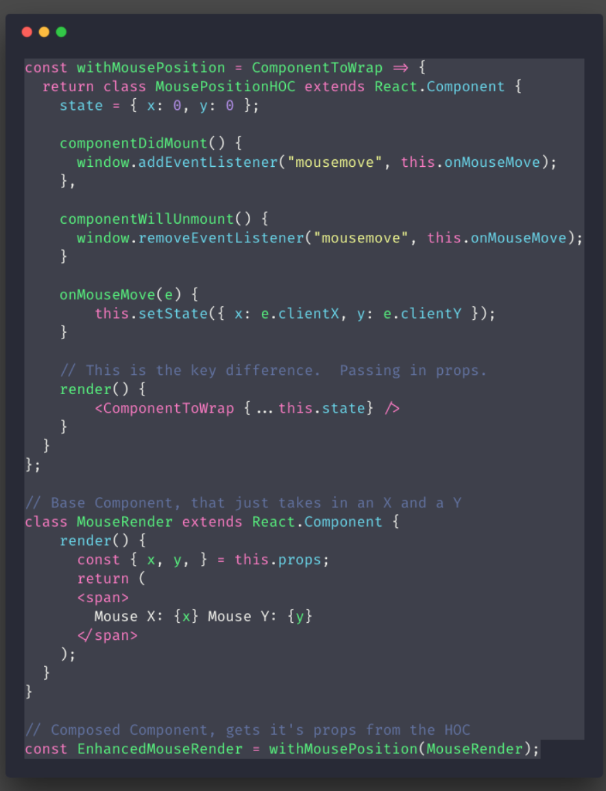
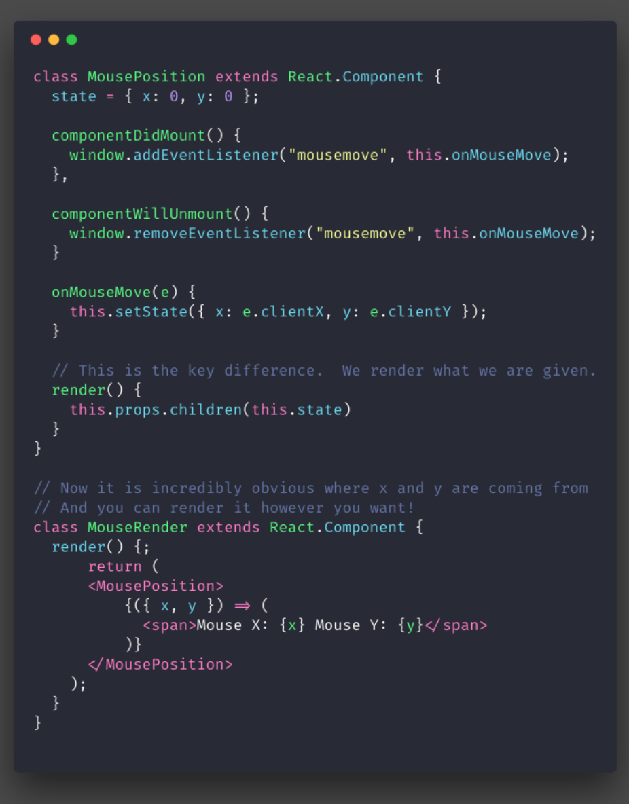
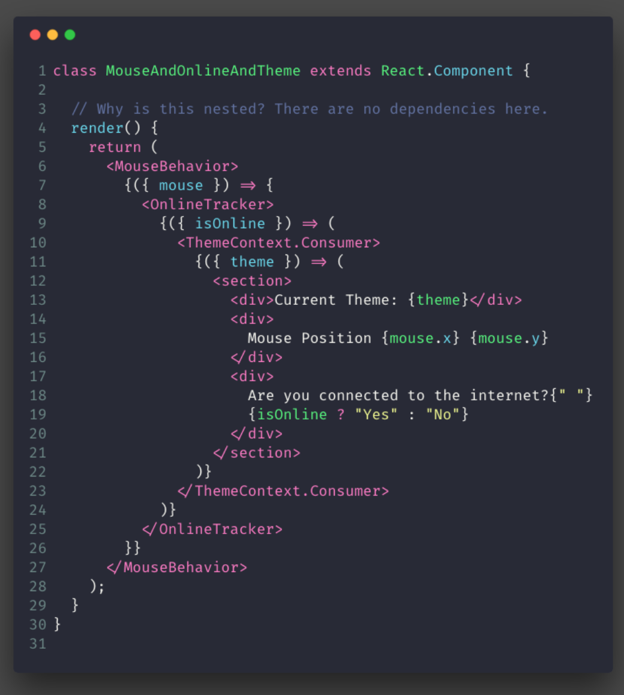
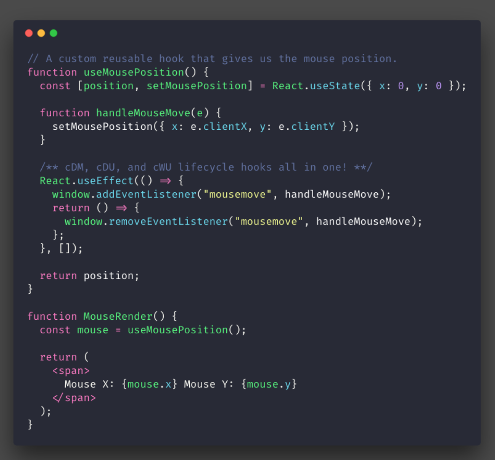

## Overview
* The problems that create react hook
  * trade off of following
    1. Mixins
    2. higher order components
    3. render props

## Mouse Monitor Code Example

### Problems
* If you need that mouse move behavior in another component you will have to rewrite the same code.

* If you add more behaviors like this, it will become harder to understand at first glance. This is because the behavior’s logic is spread across componentDidMount and componentWillUnmount 🤔

## Mixins
* Is a type of inheritance

### Problems
1. Implicit Dependency
  * Example
    * Programmer A write a stateful component(code: Target)
    * Programmer B add a mixin on top of the stateful component
    * Programmer A wants to share the state of Target with its siblings, so he move the states up to parent.
    * Now: Should Programmer A edit the mixin ?

2. Name Clashes
  * Example
     * you have a Mixin called FluxListenerMixin with handleChange() mehtod.
     * you have another Mixin called WindowSizeMixin with a method also call handleChange().
     * You can neither use both of them, nor define any method name handleChange in your component.
  * In Your Own code
    * rename the mixin.
    * alter all components that use mixin.
  * Has conflict with third party.

3. Snowballing complexity
  * https://reactjs.org/blog/2016/07/13/mixins-considered-harmful.html

4. Hard to figure it out where the state comes from.

## HOC

* Composition
  * Solve Implicit Dependency(Where state comes from). The wrapped component just get data from props.

* Problems
  1. What if we wanted to render something different though? Do we always need to make a new component?
  2. Name clashes. Because the props name has been decided by HOC.

## Render Props & Children as a Function

* Benefits
 * Understand what are props for clearly
 * Change props name to prevent name collisions
 * Flexible control of what we want to render.
 * Easy for new developer to find the code. cmd + f

* Drawback
  * nested render props component
    * false sense of hierarchy

* Here we come!! react hook!!
  1. solve above problems
  2. flat
  3. declarative

## Hooks

### Features
  * Using following feature without class (extends React.Component)
   1. state
   2. life cycle: componentDidMount, update....

  * Tip: If you’re familiar with React class lifecycle methods, you can think of useEffect Hook as componentDidMount, componentDidUpdate, and componentWillUnmount combined.

### Benefits
  * Not only is the behavior in its own neat little package, useEffect stops it from being spread across three different lifecycle hooks
  * Where the component is getting this data from is incredibly clear, it’s nestled neatly inside the render function.
  * No matter how many of these I need to bring in, my code won’t become increasingly nested.

### React Class-style Problems
  1. In old time, you may need to do some side effects(change value of props of document) after render. You have to duplicate code in componentDidMount and componentDiUpdate
  2. Same task logic spread around in different methods of life cycles.
  * Solution useEffect

### Some Catches
* call hook at top level of the render function
* can’t conditionally use them and recorder them
* Can only use it in function component.
* There aren’t hook primitives for componentDidCatch or getSnapshotBeforeUpdate.

## References
[React - Hook](https://medium.freecodecamp.org/why-react-hooks-and-how-did-we-even-get-here-aa5ed5dc96af)
[Mixin Harmeful - React](https://reactjs.org/blog/2016/07/13/mixins-considered-harmful.html)
[Javascript Mixin](https://javascript.info/mixins)
[Hooks Effect](https://reactjs.org/docs/hooks-effect.html)
