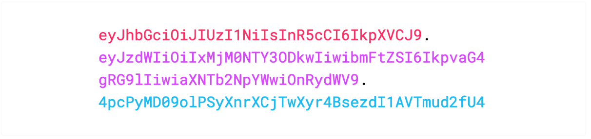

# JSON Web Token (JWT)
* an open standard
* define a **compact && self-contained** way for securely transmitting information between parties as a JSON object
* the info is signed so it can be verified and trusted
* signed by (encrypted || compressed)
    1. secret (HMAC algorithm)
    2. Public/Private keys pair using RSA (or ECDSA)
* Signed tokens can verify the integrity of the claims contained within it, while encrypted tokens hide those claims from other parties.

## What is JWT for
1. Authorization
    * login system
2. Information Exchange
    * signed the data by public/private key pairs
    * make sure the sender's identity
        * github: private key at local / public key at github server to do ssh
        * When tokens are signed using public/private key pairs, the signature also certifies that only the party holding the private key is the one that signed it.
    * header + payload -> black box (sign algorithm) -> signature
    * signature: verify that the content hasn't been tampered with


## JWT Structure
* base64Url String
* `Header.Payload.Signature`
    * `xxxx.yyyy.zzzz`

#### Header

* typically contain two parts
    1. type of token
    2. signing algorithm

* possible signing algorithms
    * RSA
    * HMAC---SHA-256

* header data is Base64Url encoded as first part of the JWT string
    * object -> string

```js

{
  alg: "HS256",
  type: "JWT"
}

```

#### Payload
* contains claims
    * claims
        * statements about entities
            * entities
                1. user-related data
                2. additional data

* three types of claims
    1. [registered](https://tools.ietf.org/html/rfc7519#section-4.1)
        * predefined claims
        * optional && recommended
        * three characters key is meant to be compact
        * examples
            1. `iss`: issuer
            2. `exp`: expiration time
            3. `sub`: subject
            4. `aud`: audience
    2. public
        * everyone who use the token can define it
        * name rules: [IANA JSON Web Token Registry](https://www.iana.org/assignments/jwt/jwt.xhtml)
            * can only use the name inside the table
    3. private
        * These are the custom claims created to share information between parties that agree on using them and are neither registered or public claims.

* example
  ```js

    {
    "sub": "1234567890",
    "name": "John Doe",
    "admin": true
    }
  ```

* the payload is Base64Url encoded to form second part of the JWT


#### Signature
* issued by my own API Server
* the app server (client) will not generate any signature
* algorithm
    * HMAC - SHA256 with a secret key (not shared)
    * RSA with (public/private pair)
* input
    1. base64url encoded header
    2. base64url encoded payload
* example
```js
  HMACSHA256(
  base64UrlEncode(header) + "." +
  base64UrlEncode(payload),
  secret)
```
* steps
    1. app request with password(PW) + account name(AN)
    2. api server receive PW + AN and generate signature with the secret
    4. api server responses with jwt
    3. app request again (with jwt) and then the api server will generate the signature again try to match the signature with the signature from app request
* purpose
    * data integrity
    * user authentication (check client's identity) (jwt need to be signed with private key)


## JWT


## How JWT Works
*

## Note
* typically, JWT is **not encrypted** it just signed
* authentication (JWT) is subject to MitM attacks  (Man in the Middle)
    *  These attacks happen when an attacker can VIEW YOUR NETWORK traffic as you make requests over the internet. This is what your ISP can see, the NSA, etc.
    * solution:
        * TLS/SSL prevent MitM
        * OAuth2: TEMPORARY tokens


## Questions
* What is the point that don't store sensitive data in JWT
    * what is sensitive data ???
        * my guess: credit card number, social security number ??
    * my question
        * if I use the jwt signature to do identification
            * pass: access data server
            * fail: deny access
        * if the hacker get the token, he/she can get whatever he likes -> so it dosen't really matter if I store sensitive data in the JWT right???
    * My Answer
        * signature is just like a key. Say, if someone illegally obtain your key, if the antagonist do not know what is the key for (which house, or vault) then it is useless. However, if the antagonist obtain your social security number or credit card number then he can do a lot of harm to you.
    * To Do
        * ask the question on stackexchange

## How do JSON Web Tokens work?
* don't store token in localStorage in browser
    * you should store jwt in cookie
        * prevent XSS attack
    * store jti in localStorage
        * jti is for blacklist
    * store CSRF token/id in localStorage
* Authorization header
    * communication between authorizatoin-server with following
        1. resource-server (third-party server)
        2. mobile app
    * no CORS issue
* don't put sensitive data in token

* basic flow
    * parties
        1. auth-sever (AS)
        2. front-end-app (FEA)
        3. resource-server (RS)
    * steps
        1. FEA requests authorization to AS
            * [ref](https://openid.net/specs/openid-connect-core-1_0.html#CodeFlowAuth)
        2. AS return accessToken
        3. FEA requests resource from RS with accessToken
        4. RS confirm with the auth-server for accessToken


## Why should we use JSON Web Tokens?
* JSON is less verbose and smaller than XML
* JSON parsers are supported in native javascript language
* check the website content

## To Read
* [handbook](https://auth0.com/resources/ebooks/jwt-handbook)
* [session based -> token based](https://auth0.com/blog/stateless-auth-for-stateful-minds/#Example--Using-Auth0-and-JWTs-for-Authentication-and-Client-Side-Sessions)


## References
* [intro](https://jwt.io/introduction/)
* [debugger](https://jwt.io/)
* [JSON Web Token Introduction](https://jwt.io/introduction/)
* [what is jwt is stolen](https://stackoverflow.com/questions/34259248/what-if-jwt-is-stolen)
