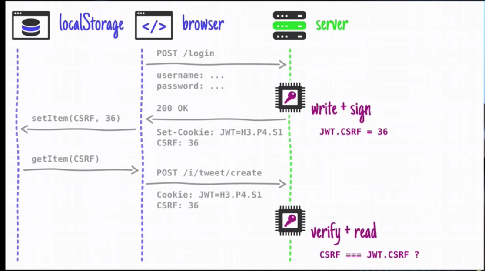

# Important!!!

## Note
* we should not compare JTW with cookie, since they are two different things
* we can compare sessionId with JWT

## Benefit of jwt
* stateless
    * no need distributed cache system anymore
* can work across different languages
* good for micro-services architecturer (**why!?**)
    * what is micro services
        * split logics in one bug junk of service to different servers(services)
              * shopping service
                  1. car handler
                  2. customer service
                  3. authorization server
                  4. recommendation server

## Store JWT in cookie or Authorization header
1. cookie
    * for web
2. Authorization header
    * authorization server works as third-party server
    * provides service to third party server, app....

## Best Practice for transmitting JWT between browser and server
1. store JTW in cookie with secure and httpOnly flag
    * prevent XSS
2. utilize CSRF token/id to prevent CSRF (37:00 in video)
    * naming
        * also called authenticity token
        * synchronization pattern
    * you can store CSRF token in localStorage

#### Overview

#### example
    1. user send login request to server
    2. server responses with JWT and set csrfId in header
        * JWT
            * add csrfId in payload with other claims and sign it
            * server stores JWT in cookie (secure + httpOnly flag)
        * server sets a header for csrfId
    3. user store csrfId in localStorage (this is the only time, you can store sensitive info in localStorage)
        * malicious script
            * can not access cookie (XSS fail)
            * only read csrfId (it's okay)
        * malicious website
            * can not trick user to send malicious request to resource server since it dose not contain any csrfId
    4. user sends another request to server
          * with cookie
          * retrieve csrfId from localStorage and put it in header
    4. server receives request
        1. verify jwt
        2. decode payload then compare csrfId with the csrfId in header

#### Cross Site Request Forgery
    * user has seesionId or access token of `bank.com` in cookie
        * hacker tricks user to browse malicious website and use clicks on malicious content at the website to send request to `bank.com`

## To Read
* what is microservice exactly
* hybrid: sessionId + jwt (start at 44:52 in video)

## Refs
* [ref # 1](https://www.youtube.com/watch?v=67mezK3NzpU)
